<div align="center">
  <h1 style="text-align: center;font-weight: bold">PRAKTIKUM 4<br>SISTEM OPERASI</h1>
  <h4 style="text-align: center;">Dosen Pengampu : Dr. Ferry Astika Saputra, S.T., M.Sc.</h4>
</div>
<br />
<div align="center">
  
  <h3 style="text-align: center;">Disusun Oleh : </h3>
  <p style="text-align: center;">
    <strong>Marieta Nona Alfani (312350026) </strong><br>
    <strong>Ale Perdana Putra Darmawan (3123500027) </strong><br>
    <strong>Kanisius Keru Okok Dinggon(3123500028)</strong>
  </p>
<h3 style="text-align: center;line-height: 1.5">Politeknik Elektronika Negeri Surabaya<br>Departemen Teknik Informatika Dan Komputer<br>Program Studi Teknik Informatika<br>2023/2024</h3>
  <hr><hr>
</div>

## Daftar Isi
1. [Dasar Teori](#Dasar-teori)
2. [Soal](#soal)
3. [Referensi](#Referensi)

## Tugas Pendahuluan:</br>
1. Apa yang dimaksud redirection?</br>
  pembelokan sebuah output ke daerah yang dituju</br>
2. Apa yang dimaksud pipeline?</br>
   mengambil output sebelumnya untuk dijadikan input untuk proses selanjutnya</br>
3. Apa yang dimaksud perintah di bawah ini : echo, cat, more, sort, grep, wc, cut, uniq</br>
   echo menampilkan pesan yang diketik secara langsung, cat menampilkan isi sebuah file, more untuk menampilkan sebuah output tetapi akan dipisah secara per layar, sort untuk mensortir sebuah kalimat/kata mengikuti nomor ascii, grep berfungsi untuk mengambil kata yang telah dideklarasi, wc adalah word count untuk menampilkan jumlah kata, jumlah karakter, dan jumlah baris, Digunakan untuk mengambil kolom tertentu dari baris-baris masukannya, yang ditentukan pada option –c, dan uniq Digunakan untuk menghilangkan baris-baris berurutan yang mengalami duplikasi, biasanya digabungkan dalam pipeline dengan sort.</br>
## Dasar teori
#### 1. PROSES I/O:</br>
Sebuah proses memerlukan Input dan Output. Instruksi (command) yang diberikan pada Linux melalui Shell disebut sebagai eksekusi program yang selanjutnya disebut proses. Setiap kali instruksi diberikan, maka Linux kernel akan menciptakan sebuah proses dengan memberikan nomor PID (Process Identity). Proses dalam Linux selalu membutuhkan Input dan menghasilkan suatu Output.
Dalam konteks Linux input/output adalah :
- Keyboard (input)
- Layar (output)
- Files
- Struktur data kernel
- Peralatan I/O lainnya (misalnya Network)

#### 2. FILE DESCRIPTOR
Linux berkomunikasi dengan file melalui file descriptor yang direpresentasikan melalui angka yang dimulai dari 0, 1, 2 dan seterusnya. Tiga buah file descriptor standar yang lalu diciptakan oleh proses adalah :
- 0 = keyboard (standar input)
- 1 = layar (standar output)
- 2 = layar (standar error)
Linux tidak membedakan antara peralatan hardware dan file. Linux memanipulasi peralatan hardware dengan memperlakukannya sama dengan ketika memperlakukan sebuah file.

#### 3.PEMBELOKAN (REDIRECTION)
Pembelokan dilakukan untuk standard input, output dan error, yaitu untuk mengalihkan file descriptor dari 0, 1 dan 2.

#### 4. PIPA (PIPELINE)
Mekanisme pipa digunakan sebagai alat komunikasi antar proses.

#### 5. FILTER
Filter adalah utilitas Linux yang dapat memproses standard input (dari keyboard) dan menampilkan hasilnya pada standard output (layar). Contoh filter adalah cat, sort, grep, pr, head, tail, paste dan lainnya. 
- Perintah ```grep``` Digunakan untuk menyaring masukannya dan menampilkan baris-baris yang hanya mengandung pola yang ditentukan. Pola ini disebut regular expression.
- Perintah ```wc``` Digunakan untuk menghitung jumlah baris, kata dan karakter dari baris-baris masukan yang diberikan kepadanya. Untuk mengetahui berapa baris gunakan option –l, untuk mengetahui berapa kata, gunakan option –w dan untuk mengetahui berapa karakter, gunakan option –c. Jika salah satu option tidak digunakan, maka tampilannya adalah jumlah baris, jumlah kata dan jumlah karakter.
- Perintah ```sort``` Digunakan untuk mengurutkan masukannya berdasarkan urutan nomor ASCII dari karakter.
- Perintah ```cut``` Digunakan untuk mengambil kolom tertentu dari baris-baris masukannya, yang ditentukan pada option –c.
- Perintah ```uniq``` Digunakan untuk menghilangkan baris-baris berurutan yang mengalami duplikasi, biasanya digabungkan dalam pipeline dengan ```sort```.

## Soal
1. Analisa hasil percobaan 1 sampai dengan 4, untuk setiap perintah jelaskan tampilannya.
Percobaan 1 : File descriptor</br>
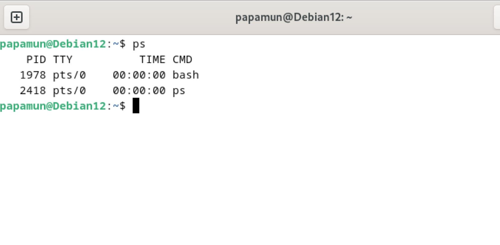</br>
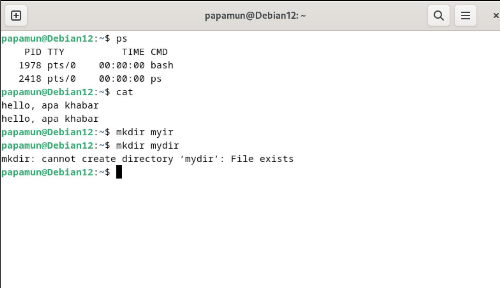</br></br>

Percobaan 2 : Pembelokan (redirection)</br>
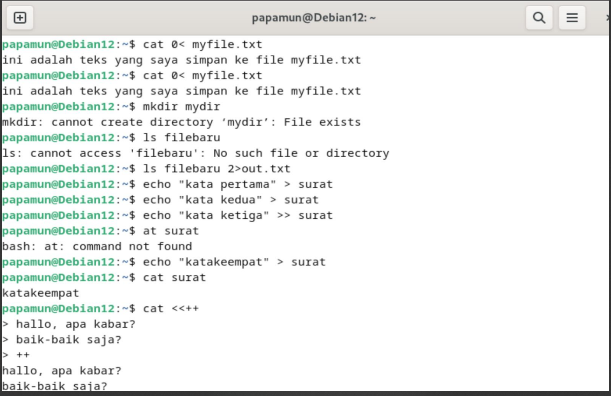</br>
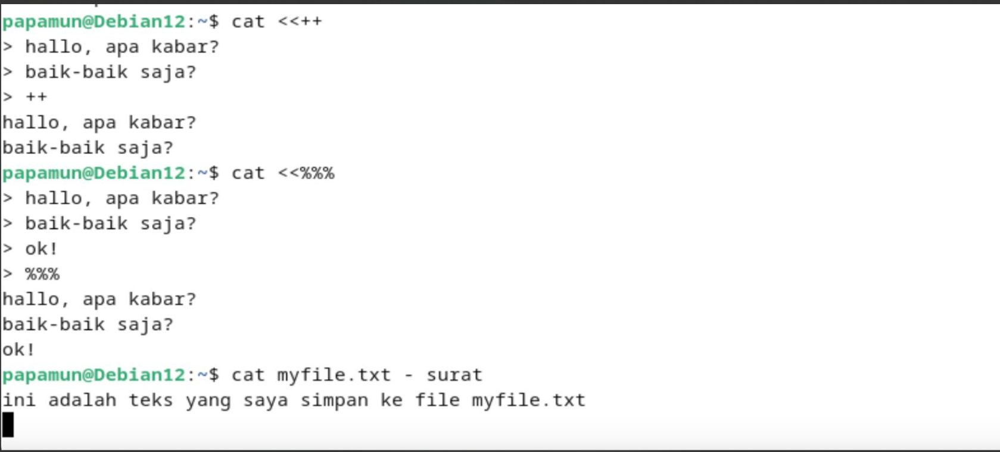</br></br>

Percobaan 3 : Pipa (pipeline)</br>
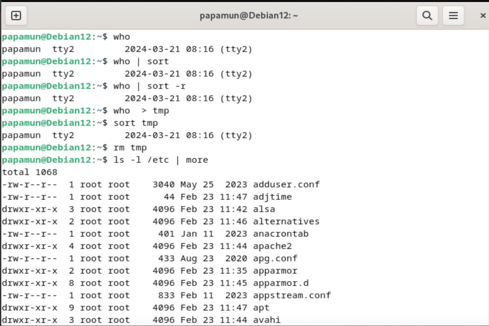</br>
</br></br>

Percobaan 4 : Filter
</br>
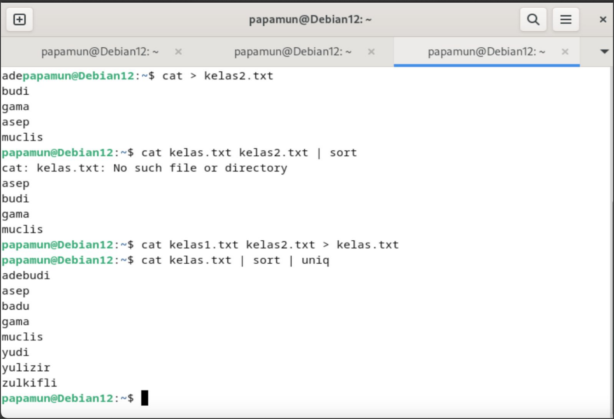</br></br>

3. Kerjakan latihan diatas dan analisa hasilnya
- Lihat daftar secara lengkap pada direktori aktif, belokkan tampilan standard output ke file baru.</br>
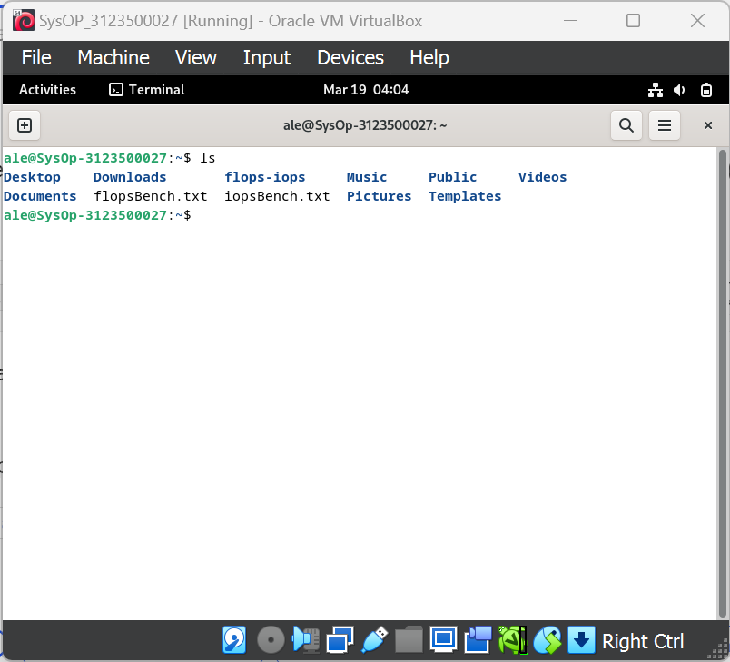</br>
</br></br>

- Lihat daftar secara lengkap pada direktori /etc/passwd, belokkan tampilan standard output ke file baru tanpa menghapus file baru sebelumnya.</br>
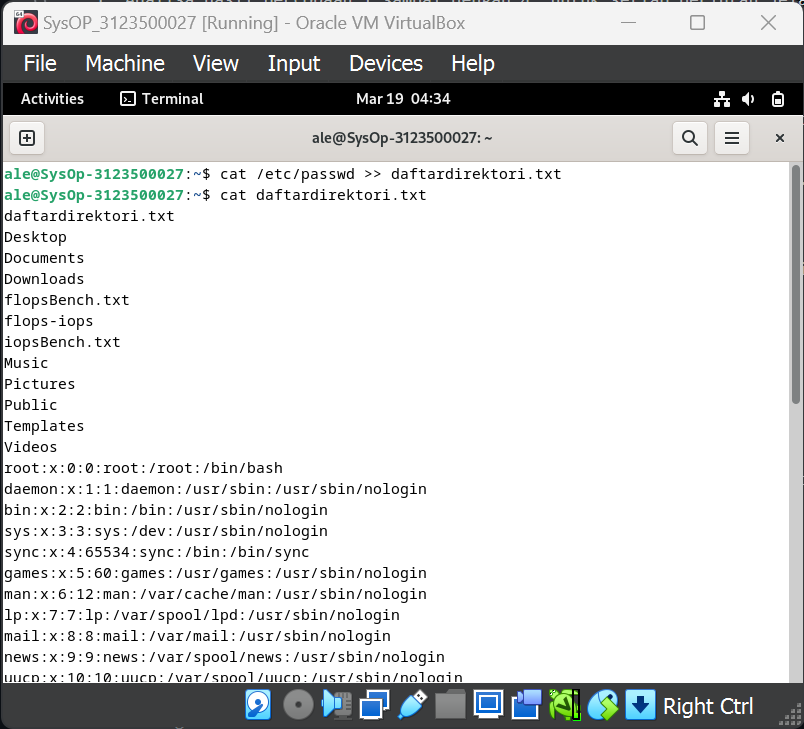</br>
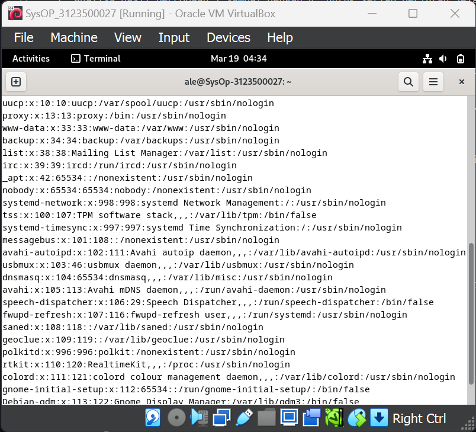</br>
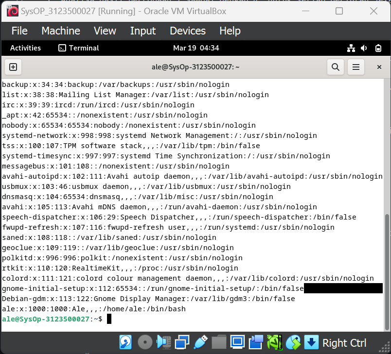</br></br>

- Urutkan file baru dengan cara membelokkan standard input.
</br>
</br>
</br></br>

- Urutkan file baru dengan cara membelokkan standard input dan standard output ke file baru.urut.
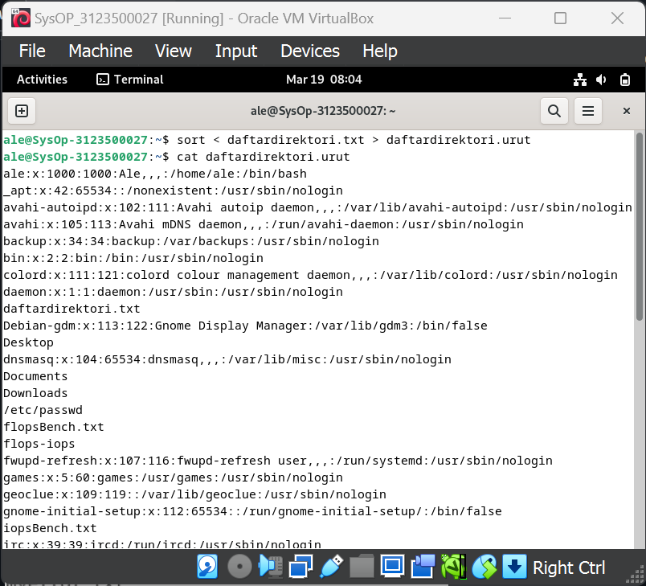</br>
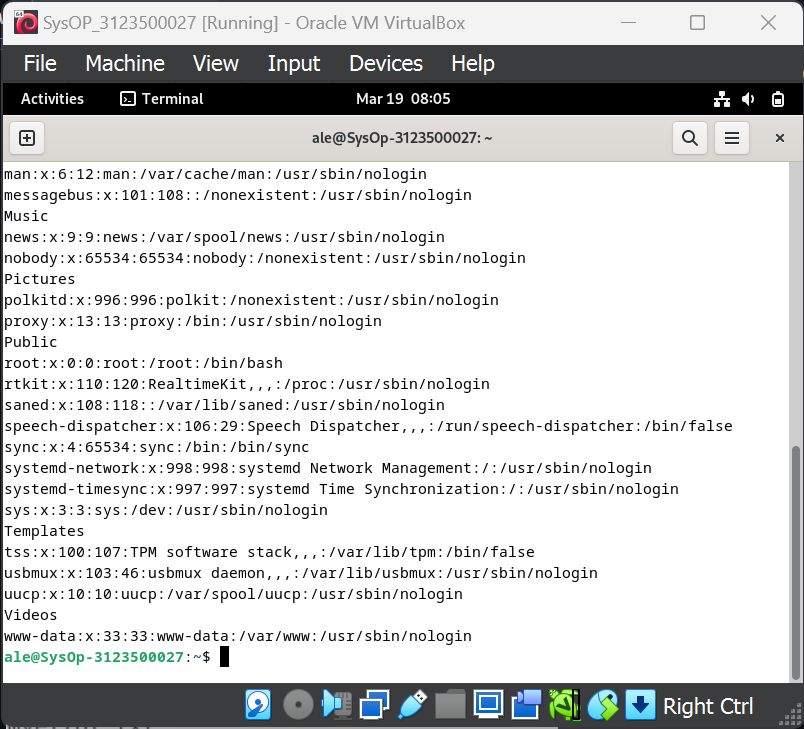</br></br>

- Buatlah direktori latihan 2 sebanyak 2 kali dan belokkan standard error ke file rmdirerror.txt.
</br></br>

- Urutkan kalimat berikut :
```
Jakarta
Bandung
Surabaya
Padang
Palembang
Lampung
```
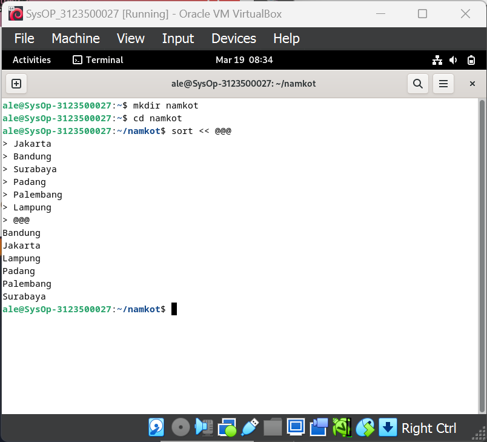</br></br>

- Hitung jumlah baris, kata dan karakter dari file baru.urut dengan menggunakan filter dan tambahkan data tersebut ke file baru.
</br>
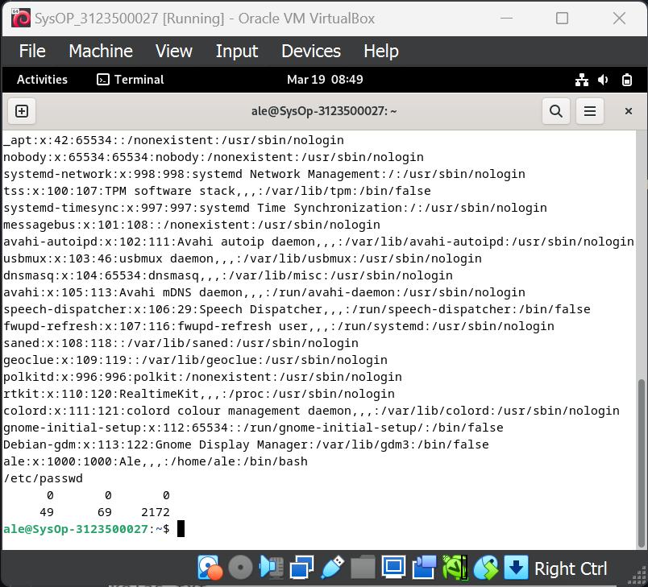</br></br>

- Gunakan perintah di bawah ini dan perhatikan hasilnya.
```
 $ cat > hello.txt
 dog cat
 cat duck
 dog chicken
 chicken duck
 chicken cat
 dog duck
 [Ctrl-d]
 $ cat hello.txt | sort | uniq
 $ cat hello.txt | grep “dog” | grep –v “cat”
```
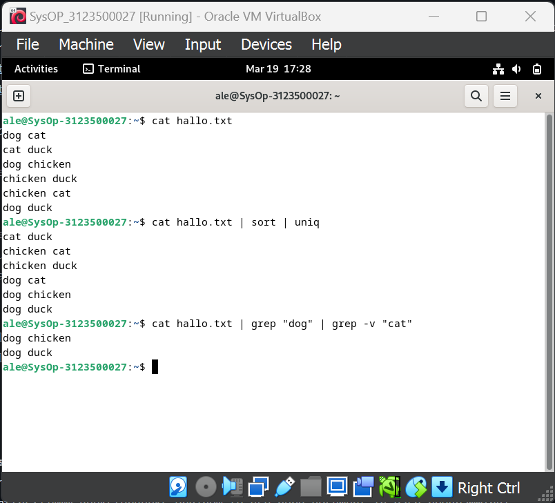</br></br>

3. Berikan kesimpulan dari praktikum ini.</br>
Kesimpulan dari serangkaian percobaan yang telah dilakukan menunjukkan pemahaman yang kuat dalam penggunaan perintah dasar sistem operasi Linux/Unix. Dari penggunaan perintah seperti ls, nano, cat, sort, hingga mkdir dan cd, telah ditunjukkan kemampuan untuk melakukan berbagai tugas seperti melihat daftar direktori, mengedit dan menampilkan isi file, serta mengelola file dan direktori. Penggunaan redirection dengan simbol seperti >, >>, dan 2> juga ditunjukkan dengan baik, memungkinkan pengalihan output dari satu perintah ke perintah lainnya atau ke dalam file. Selain itu, penggunaan pipeline (|) membantu dalam mengalirkan data antar perintah, memungkinkan eksekusi serangkaian perintah secara berurutan untuk memproses data dengan cara yang lebih kompleks.

Pengolahan file dan direktori seperti pembuatan, penyuntingan, dan analisis isi file juga terlihat dalam latihan tersebut, menunjukkan kemampuan dalam mengelola data dalam konteks sistem operasi. Penggunaan perintah khusus seperti wc untuk menghitung statistik file dan grep untuk pencarian pola dalam teks menunjukkan pemahaman mendalam tentang alat-alat sistem operasi. Selain itu, pemahaman tentang ASCII dan penggunaan sort untuk pengurutan berdasarkan urutan ASCII, serta uniq untuk menghilangkan duplikasi, menunjukkan keterampilan dalam manipulasi dan analisis data teks.

Dari serangkaian percobaan yang dilakukan, kita dapat mengambil kesimpulan bahwa pengelolaan aliran masukan dan keluaran dalam lingkungan terminal sangatlah penting. Teknik-teknik seperti penggunaan file descriptor, pembelokan (redirection), pipa (pipeline), dan filter menjadi kunci dalam memungkinkan pengguna untuk mengatur dan memanipulasi data dengan lebih fleksibel dan kompleks. Melalui redirecting standar output dan input, pengguna dapat mengalihkan keluaran dari perintah ke file tertentu dan mengambil input dari file daripada dari keyboard. Penggunaan pipa memungkinkan pengaliran keluaran dari satu perintah sebagai masukan ke perintah berikutnya, membentuk alur kerja yang terstruktur dan efisien. Filter seperti grep, wc, sort, dan uniq memberikan kemampuan untuk mencari, menghitung, mengurutkan, dan mengelompokkan data sesuai dengan kebutuhan.

## Referensi
Sumber 1: https://www.geeksforgeeks.org/introduction-linux-shell-shell-scripting/?ref=shm_ </br>
Sumber 2: https://www.geeksforgeeks.org/how-to-use-here-document-in-bash-programming/
